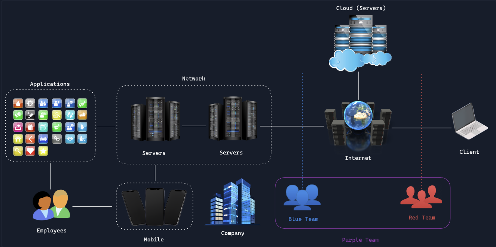

OpSec --> La Seguridad Operacional (encargada de manteneru un entorno seguro 
para las operaciones diarias de una organización.

**---- Procesos de OpSec ----**
1. Identificación de los activos --> Identficar cosas que sean confidenciales
2. Identificación de amenazas --> Que podria salir mal
3. Identificación de vulnerabilidades --> Prevenir el problema (contraseñas, credenciales...)
4. Control de acceso --> Determinar quien puede acceder y quien NO
5. Monitoreo --> Proceso continuo que se adapta a las nuevas amenazas y cambios para mantenerlo seguro

<b>---- Responsabilidades de OpSec ---- </b>   
OpSec tiene la responsabilidad de mantener segura a la empresa con pruebas de
penetracon y corrigiendo errores con su equipo.

<b>---- Recuperación ante Desastre ----  </b>  
Se trata de restablecer el funcionamiento de los componentes esenciales lo antes posible.

<b> ---- Continuidad del Negocio ---- </b>         
Ante una perdida del sistema ha de haber un plan B para rebastecer el sistema para que los trabajadores
puedan seguir trabajando. 

---

### <b>  ---- Seguridad en la Nube ---- </b> ###
1. Proveedor de servicios:
  - Se encarga de darte las instalaciones y resguardarte el edificio y toda la infraestructura
2. Tu / Administrador:
  - El cliente es responsable de proteger su unidad de almacenamiento, cerrandola corectamente y
    manteniendo su llave o codigo de acceso a salvo.
3. Equipo de seguridad:
  - Planifican y supervisan que todo este correctamente como si fueran un jefe de seguridad

---

### <b>---- Seguridad fisica ---- </b> ###
  - Esto consiste en la protección del hardware y las instalaciones que almacenan y procesan datos.
  - El ojetivo es evitar que personas no autorizadas accedan físicamente a estos recursos, lo que podria 
    provocar filtraciónes de datos, robos y daños.
  - El objetivo principal de la seguridad física es crear capas de medidas de protección que disuadan,
    detecten, retrasen yrespondan a posibles amenazas físicas.
Es crucial por varias razones:
  - Proteger activos valiosos
  - Proteger al personal
  - Ayuda a mantener la continuidad operativa
  - Constituye una parte fundamental del cumplimiento normativo
Las personas que se encargan de que las instalaciones se antengan seguras son responsables de lo que
le ocurra fisicamente a los servidores de manera que tienen que implementar medidas de seguridad para
que no haya ningun problema
---
  
---